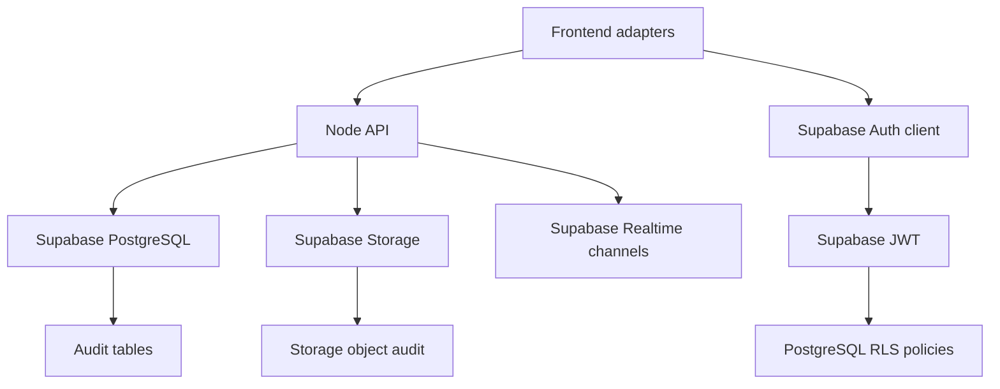

# Project A1 - Supabase Architecture Migration

Status: Credential-ready implementation plan

This document converts the RentasHub RC-0.5 activation directive into a Supabase migration architecture. It does not activate a live Supabase project. Real activation requires valid Supabase credentials, reviewed driver installation, backup approval, and staging project access.

## Objective

Activate Supabase as the primary production backend for RentasHub without adding new marketplace features.

The target backend is:

- Supabase PostgreSQL for persistent records.
- Supabase Auth for user identity and sessions.
- Supabase Storage for uploads and documents.
- Supabase Realtime for future live status and auction-event subscriptions.
- PostgreSQL Row Level Security for tenant-safe access.

## Architecture Target



## Environment Strategy

| Environment | Purpose | Data | Provider Mode |
| --- | --- | --- | --- |
| Development | Local development and demos | Local/demo data | JSON fallback or local Supabase dev |
| UAT | Internal testing, supplier pilot, closed beta validation | Supabase staging data | Supabase PostgreSQL/Auth/Storage |
| Production | Paid pilot and public launch after certification | Production data | Supabase production project |

Required variables:

```text
DATABASE_PROVIDER=postgres
DATABASE_POSTGRES_VENDOR=supabase
DATABASE_URL=<server-only Supabase PostgreSQL URL>
AUTH_PROVIDER=supabase
SUPABASE_URL=<Supabase project URL>
SUPABASE_ANON_KEY=<browser-safe anon key>
SUPABASE_SERVICE_ROLE_KEY=<server-only service role key>
FILE_STORAGE_PROVIDER=supabase
FILE_STORAGE_BUCKET_PUBLIC_ASSETS=public-assets
FILE_STORAGE_BUCKET_SUPPLIER_LOGOS=supplier-logos
FILE_STORAGE_BUCKET_PRIVATE_VERIFICATION=private-verification
FILE_STORAGE_BUCKET_PRIVATE_INSPECTIONS=private-inspections
FILE_STORAGE_BUCKET_PRIVATE_CLAIMS=private-claims
FILE_STORAGE_BUCKET_PRIVATE_DISPUTES=private-disputes
SUPABASE_REALTIME_ENABLED=false
```

## Secrets Strategy

- `SUPABASE_SERVICE_ROLE_KEY` is server-only and must never use a `VITE_` prefix.
- `DATABASE_URL` is server-only and must never be embedded in frontend bundles.
- `SUPABASE_ANON_KEY` may be browser-visible only for approved Supabase Auth client flows.
- Production secrets must be stored in hosting provider encrypted environment variables, CI/CD encrypted secrets, or a managed secrets vault.
- Real secrets must not be stored in docs, ZIPs, chat, screenshots, or source control.

## Domain Migration Plan

| Domain | Target Storage | Required Tables/Objects |
| --- | --- | --- |
| Users | Supabase Auth + `users` profile table | `auth.users`, `users`, `user_role_assignments` |
| Auctions | PostgreSQL | `auctions`, `auction_bids`, `audit_logs`, `notification_events` |
| Listings | PostgreSQL + Storage | `assets`, `asset_categories`, `file_metadata` |
| Inspection Marketplace | PostgreSQL + Storage | `inspection_marketplace_requests`, `file_metadata` |
| Transport Marketplace | PostgreSQL | `transport_marketplace_requests` |
| Financing Marketplace | PostgreSQL | `financing_marketplace_referrals` |
| Documents | PostgreSQL + Storage | `generated_documents`, `file_metadata` |
| Notifications | PostgreSQL + Realtime-ready | `notification_events`, `notifications` |
| Analytics | PostgreSQL | `analytics_events`, `trust_scores` |
| AI Recommendation Audit | PostgreSQL | `ai_recommendation_audit` |

## RLS Strategy

RLS policies are defined in `server/migrations/004_supabase_activation_architecture.sql`.

Policy principles:

- Public users may read public active listings and public auction lots.
- Authenticated users may read their own profile and owned/private records.
- Suppliers may manage their own listings, auctions, documents, and recommendation audit records.
- Inspectors, transport providers, and financing partners may access assigned service requests.
- Admin and service role access is restricted to backend/admin operations.
- Private storage and KYC evidence are never public.

## Audit Fields

Every live-domain table must support:

- `tenant_id`
- `created_by`
- `updated_by`
- `created_at`
- `updated_at`
- `deleted_at`
- JSON metadata for provider-specific details where needed

## Migration Execution Plan

1. Create Supabase staging project.
2. Store all credentials in approved secret manager or encrypted environment settings.
3. Confirm backup and restore procedure before applying migrations.
4. Set `DATABASE_PROVIDER=postgres`.
5. Set `DATABASE_POSTGRES_VENDOR=supabase`.
6. Configure `DATABASE_URL`.
7. Run migrations in order:
   - `001_initial_schema.sql`
   - `002_auth_foundation.sql`
   - `003_file_storage_foundation.sql`
   - `004_supabase_activation_architecture.sql`
8. Run seed only after UAT data scope approval.
9. Verify `/api/health/readiness` reports PostgreSQL and Supabase configuration accurately.
10. Run frontend tests, backend tests, readiness CLI, operational simulation, production build, and ZIP sanity.

## Rollback Plan

- Do not apply to production before staging validation.
- Take Supabase backup or snapshot before migration.
- Record migration checksum and timestamp.
- If migration fails before data writes, roll back to prior snapshot.
- If migration fails after partial writes, disable application traffic, restore snapshot, rerun validation, then reattempt migration with corrected script.
- Keep JSON fallback available for local demo only; do not silently fall back when `DATABASE_PROVIDER=postgres`.

## Risk Assessment

| Risk | Severity | Mitigation |
| --- | --- | --- |
| Incorrect RLS exposes private records | Critical | Staging RLS tests, admin review, security review |
| Service role key leaks | Critical | Secret vault only, repo scans, CI masking |
| Migration breaks UAT data | High | Backup, restore test, dry run |
| Frontend still reads localStorage | High | Domain-by-domain adapter migration |
| Storage policies expose private files | Critical | Private bucket policy validation |
| Realtime overexposes events | High | Channel scoping and RLS-backed subscriptions |

## Completion Criteria

Project A1 is complete when the architecture package, SQL migration, environment strategy, secrets strategy, risk assessment, rollback plan, and tests are present.

Live Supabase activation may be closed only after real credentials are supplied securely, migrations run against Supabase staging, backups and restore tests pass, and readiness reports active provider health.
