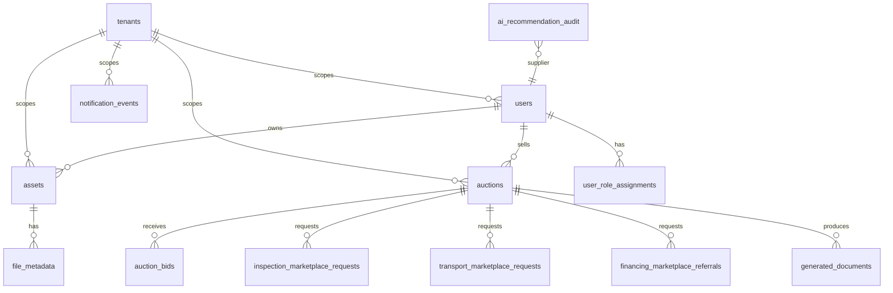

# Supabase PostgreSQL Migration Strategy

Status: Project A1 credential-ready strategy

This server-side strategy explains how to move RentasHub from JSON fallback to Supabase PostgreSQL. It does not claim an active Supabase connection.

## Provider Configuration

```text
DATABASE_PROVIDER=postgres
DATABASE_POSTGRES_VENDOR=supabase
DATABASE_URL=<server-only Supabase PostgreSQL connection string>
SUPABASE_PROJECT_REF=<project-ref>
SUPABASE_DB_POOLING_MODE=transaction
```

When `DATABASE_PROVIDER=postgres` is explicitly selected, the backend must fail clearly if `DATABASE_URL` is missing, placeholder, or the PostgreSQL driver is unavailable. It must not silently fall back to JSON.

## Migration Order

1. `001_initial_schema.sql`
2. `002_auth_foundation.sql`
3. `003_file_storage_foundation.sql`
4. `004_supabase_activation_architecture.sql`

## Schema Diagram



## Table Groups

- Core identity: `users`, `roles`, `permissions`, `role_permissions`, `user_role_assignments`.
- Marketplace core: `assets`, `asset_categories`, `bookings`, `marketplace_offers`, `wanted_requests`, `brokerage_leads`.
- Auction core: `auctions`, `auction_bids`.
- Service marketplaces: `inspection_marketplace_requests`, `transport_marketplace_requests`, `financing_marketplace_referrals`.
- Trust and operations: `reviews`, `disputes`, `trust_scores`, `claims`, `protection_plans`, `protection_selections`.
- Documents/files: `file_metadata`, `generated_documents`, `storage_objects_audit`.
- Communications: `message_threads`, `messages`, `notifications`, `notification_events`.
- Intelligence and analytics: `analytics_events`, `ai_recommendation_audit`.
- Audit: `audit_logs`.

## Supabase Auth Mapping

Supabase Auth `auth.users.id` maps to RentasHub `users.id`. Application roles are assigned in `user_role_assignments`.

Supported roles:

- customer
- supplier
- dealer
- inspector
- transport_provider
- financing_partner
- admin
- super_admin

## Supabase Realtime Preparation

Realtime should start disabled until RLS and channel scoping are verified.

Recommended first channels:

- `notification_events` for user-specific in-app alerts.
- `auction_bids` for read-only auction event streams after live bidding design approval.
- `audit_logs` for admin monitoring only.

## Validation Checklist

- Migration dry run succeeds in staging.
- RLS is enabled on all live-domain tables.
- Anonymous users cannot read private records.
- Authenticated users cannot read another user's private records.
- Suppliers cannot mutate another supplier's assets or auctions.
- Admin access works through server-controlled claims only.
- Service role access is server-only.
- Backup exists before migration.
- Restore test succeeds after migration.

## Rollback

- Preserve JSON fallback for local demo only.
- Do not export Supabase production data back to local JSON except through approved anonymized export jobs.
- If Supabase migration fails, restore the pre-migration snapshot and keep staging traffic disabled until rerun approval.
